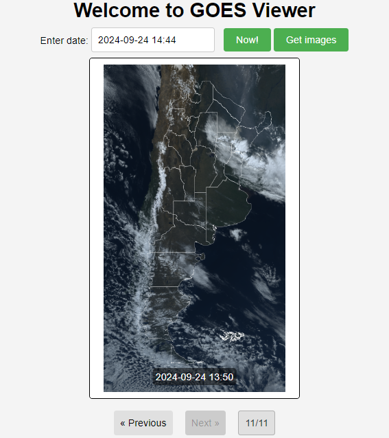

## Visualizador GOES

### Descripción 
Este proyecto descarga imágenes GOES 16 del territorio argentino desde el servidor de Google Earth Engine (GEE) a través de su API de Python y luego las visualiza en una interfaz web servida a través de Node.js. 

Las imágenes que se visualizn corresponden al período comprendido entre la fecha ingresada y 6 horas menos cada 30 minutos.

El procesamiento sobre las imágenes para obtener un producto en color verdadero se realizó siguiendo los lineamientos que se indican en el siguiente [artículo.](https://jstnbraaten.medium.com/goes-in-earth-engine-53fbc8783c16)


<p align="center">
  
</p>

### Uso
Es posible ingresar una fecha particular de interés o bien las últimas imágenes disponibles al hacer click en el boton **Now!**. La fecha debe estar en formato *yyyy-mm-dd hh:mm*. Luego al hacer click en el botón **Get images** comienza la descarga de las imágenes.

Cuando finaliza la descarga de las imágenes (puede tomar unos minutos) es posible visualizar los resultados a través de los botones **Previous** y **Next**.

### Requisitos
Es necesario contar con Python 3, Node.js y un usuario autenticado de GEE. Los pasos a seguir para logra la autenticación de GEE se pueden ver en este [artículo.](https://courses.spatialthoughts.com/install-gee-python-api.html#authentication)

Para reproducir el proyecto localmente, clonar el repositorio y ejecutar desde consola: *node server.js*

### Estructura del proyecto
```php
├── GEE
│   ├── GIS
│   │   ├── ROI.shp
│   │   └── Grid.shp
│   ├── GOES.py         # Script de Python que descarga imágenes desde Google Earth Engine
│   └── Output
│       ├── PNGs        # Carpeta que contiene las imágenes descargadas y procesadas
│       └── TSs.json    # Archivo con los timestamps de las imágenes
├── public
│   ├── index.html      # Interfaz principal del usuario
│   ├── ui.js           # Lógica de frontend en JavaScript
│   ├── styles.css
├── images
│   ├── readme_01.png   # Imágenes del README
├── server.js           # Servidor de Node.js con Express.js
├── package.json        # Dependencias de Node.js
└── README.md           # Archivo README
```
